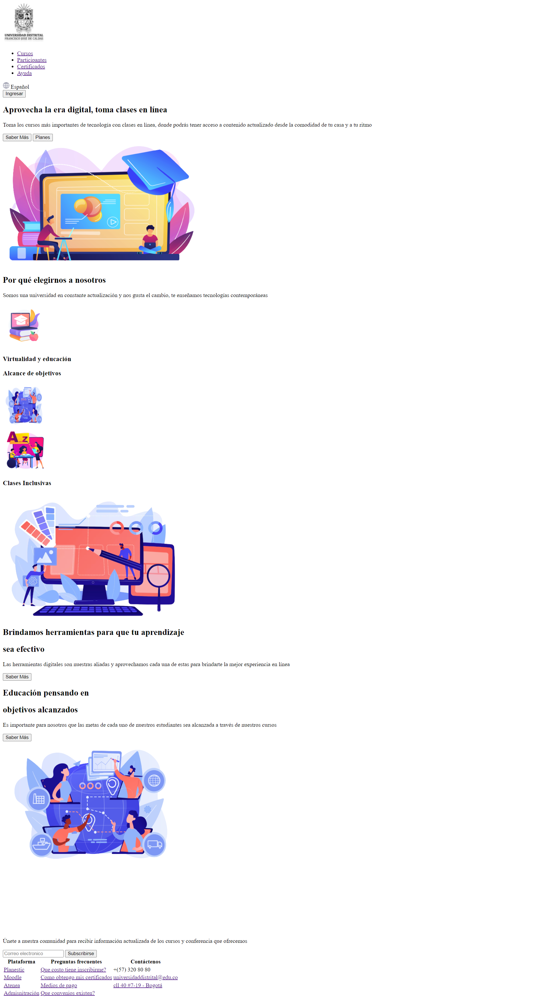
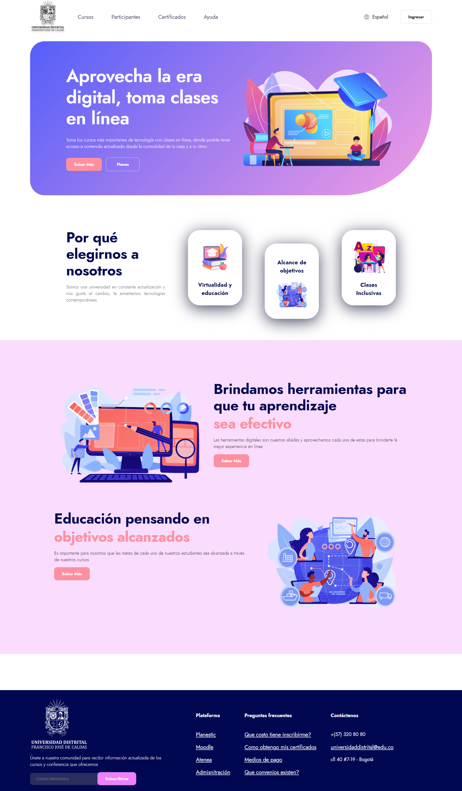
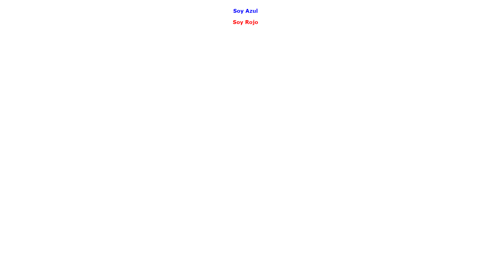
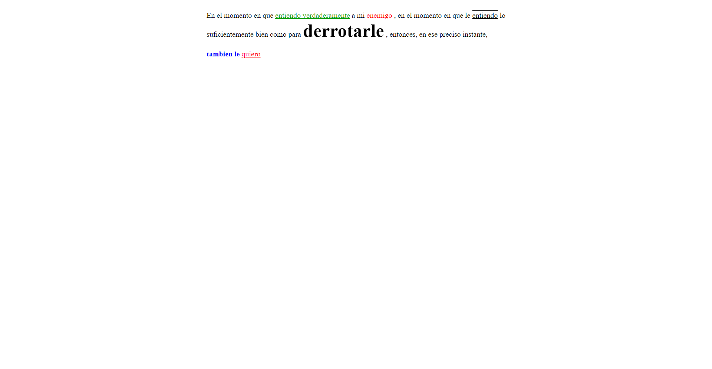
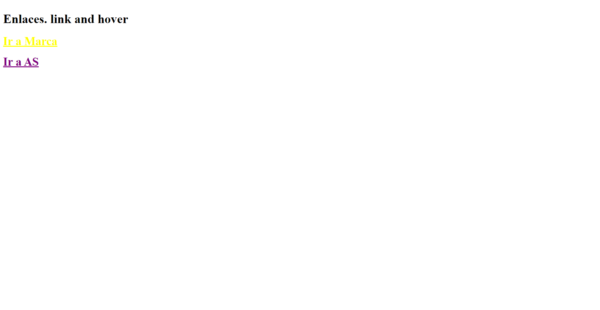
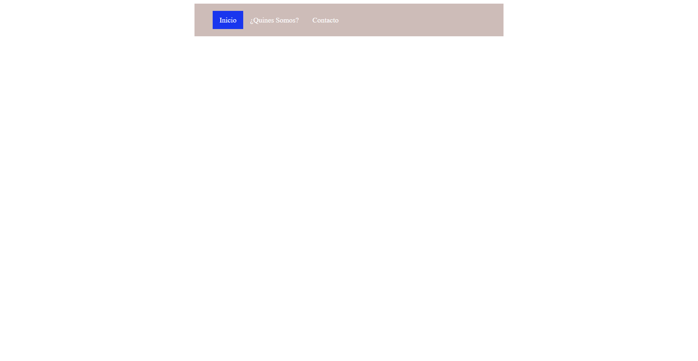
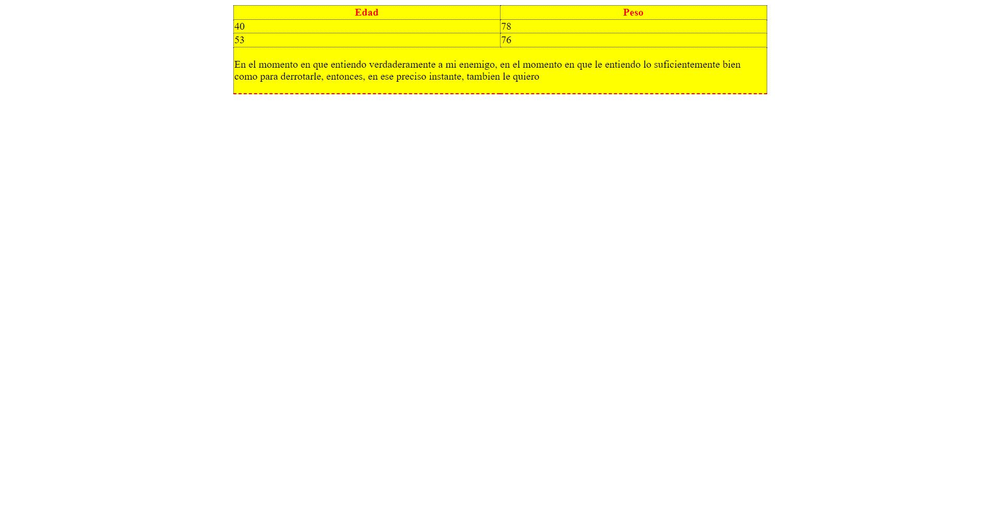
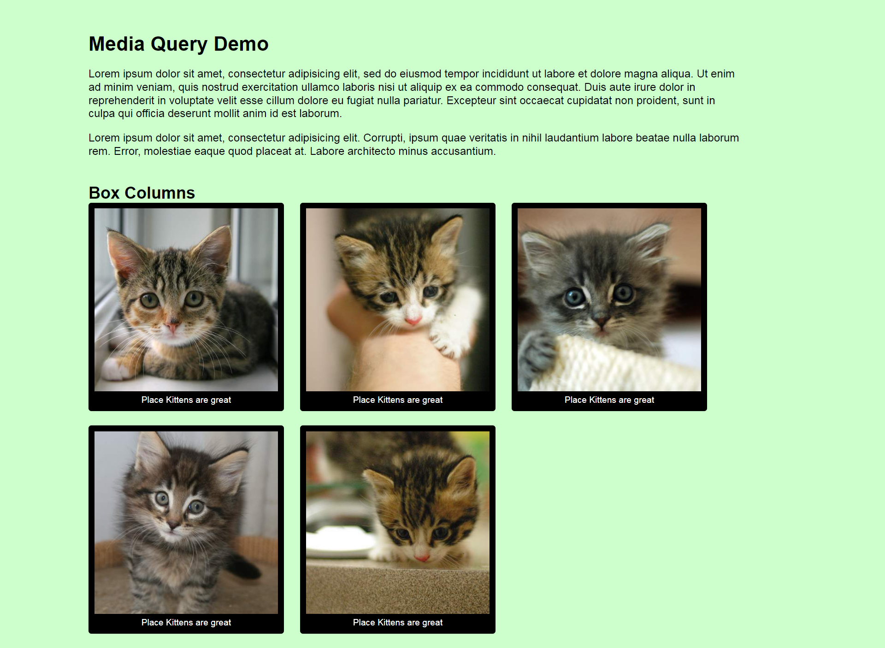
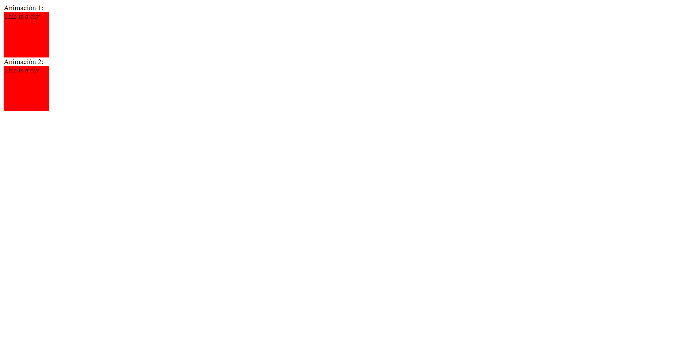
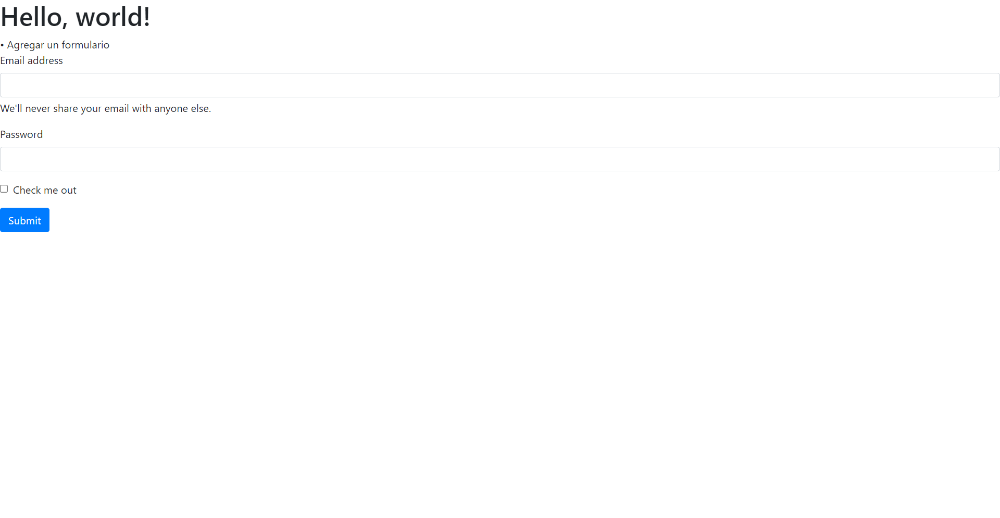

<h1>Taller Sonia Reyes</h1>

<h2>Información</h2>

Full Stack Básico - Grupo 1

Docente: Cristian Patiño

<h2>Punto 1: Enlace de Figma</h2>
<a href="https://www.figma.com/file/pichmoOgqbpdyBfVESGICs/Mockup-clase?type=design&node-id=0%3git A1&t=KZdrZgYQcYBzAqkt-1" target="_blank">Link de Figma</a>  
<a href="https://reyezonia.github.io/talle9-fullStack/">Link Pagina Web</a>

<h2>Punto 2: HTML</h2>

<h2>Punto 3: CSS </h2>

<h2>Punto 4: Títulos</h2>

<h2>Punto 5: Estilos de texto</h2>

<h2>Punto 6: Enlaces</h2>

<h2> Punto 7-8: Navegación</h2>

<h2>Punto 9: Tablas</h2>

<h2>Punto 10: Extra</h2>

<h2>Punto 11: Animación</h2>

<h2>Punto 12: Bootstrap CSS</h2>

<h6>Trabajo desarrollado por SR.</h6>